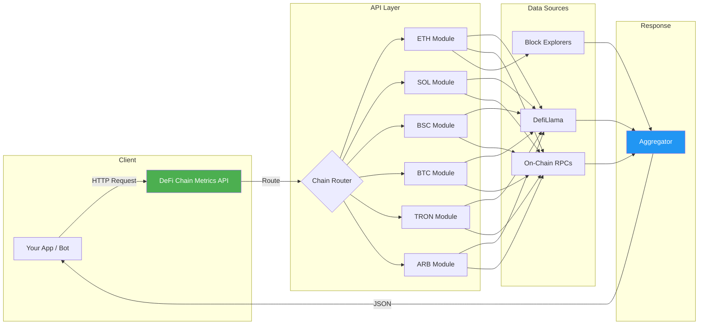

# DeFi Chain Metrics API

[](https://www.npmjs.com/package/defi-chain-metrics-api)
[](https://opensource.org/licenses/MIT)
[](https://apify.com/george.the.developer/defi-chain-metrics-api)
[](https://rapidapi.com/georgethedeveloper3046/api/defi-chain-metrics)

Real-time DeFi chain metrics API. TVL, fees, volume, bridged TVL, staking, active addresses, and more across 6 major chains. Pay-per-call pricing at **$0.01/call** — no subscriptions, no rate limits on small volumes.

## 简介

实时DeFi链上指标API。覆盖6条链（ETH、SOL、BSC、BTC、TRON、ARB），82个指标。包括DefiLlama付费墙后数据。

---

## Architecture



---

## Supported Chains

| Chain | Symbol | Chain ID | TVL (Live) | Status |
|-------|--------|----------|------------|--------|
| Ethereum | ETH | 1 | $52.76B | Active |
| Solana | SOL | — | $7.83B | Active |
| BNB Smart Chain | BSC | 56 | $5.41B | Active |
| Bitcoin | BTC | — | $5.89B | Active |
| TRON | TRX | — | $8.12B | Active |
| Arbitrum | ARB | 42161 | $3.24B | Active |

---

## Metrics (16+ per chain)

| # | Metric | Key | Description |
|---|--------|-----|-------------|
| 1 | Total Value Locked | `tvl` | Aggregate TVL in USD |
| 2 | 24h TVL Change | `tvl_change_24h` | Percentage change |
| 3 | 7d TVL Change | `tvl_change_7d` | Weekly percentage change |
| 4 | 24h Fees | `fees_24h` | Total protocol fees |
| 5 | 24h Revenue | `revenue_24h` | Protocol revenue |
| 6 | 24h Volume (DEX) | `dex_volume_24h` | Decentralized exchange volume |
| 7 | 7d Volume (DEX) | `dex_volume_7d` | Weekly DEX volume |
| 8 | Bridged TVL | `bridged_tvl` | Cross-chain bridged value |
| 9 | Staked Value | `staked_value` | Total staked in USD |
| 10 | Staking Ratio | `staking_ratio` | % of supply staked |
| 11 | Active Addresses (24h) | `active_addresses_24h` | Unique active wallets |
| 12 | Transaction Count (24h) | `tx_count_24h` | Daily transactions |
| 13 | Avg Gas Price | `avg_gas_price` | Average gas in native units |
| 14 | Market Cap | `market_cap` | Chain token market cap |
| 15 | FDV | `fdv` | Fully diluted valuation |
| 16 | Circulating Supply | `circulating_supply` | Tokens in circulation |

Additional derived metrics: `tvl_per_address`, `fee_to_tvl_ratio`, `volume_to_tvl_ratio`, and chain-specific fields bring the total to **82 metrics**.

---

## Quick Start

### Get all metrics for Ethereum

```bash
curl "https://api.apify.com/v2/acts/george.the.developer~defi-chain-metrics-api/run-sync-get-dataset-items?token=YOUR_TOKEN" \
  -X POST \
  -H "Content-Type: application/json" \
  -d '{"chain": "ethereum"}'
```

### Get specific chains

```bash
curl "https://api.apify.com/v2/acts/george.the.developer~defi-chain-metrics-api/run-sync-get-dataset-items?token=YOUR_TOKEN" \
  -X POST \
  -H "Content-Type: application/json" \
  -d '{"chains": ["ethereum", "solana", "arbitrum"]}'
```

### Get single metric across all chains

```bash
curl "https://api.apify.com/v2/acts/george.the.developer~defi-chain-metrics-api/run-sync-get-dataset-items?token=YOUR_TOKEN" \
  -X POST \
  -H "Content-Type: application/json" \
  -d '{"metric": "tvl"}'
```

---

## Response Example

```json
[
  {
    "chain": "ethereum",
    "symbol": "ETH",
    "timestamp": "2026-04-03T12:00:00Z",
    "metrics": {
      "tvl": 52760000000,
      "tvl_change_24h": 1.23,
      "tvl_change_7d": -0.87,
      "fees_24h": 4820000,
      "revenue_24h": 2410000,
      "dex_volume_24h": 1930000000,
      "dex_volume_7d": 12810000000,
      "bridged_tvl": 18420000000,
      "staked_value": 41200000000,
      "staking_ratio": 27.4,
      "active_addresses_24h": 412000,
      "tx_count_24h": 1120000,
      "avg_gas_price": "12.4 gwei",
      "market_cap": 389000000000,
      "fdv": 389000000000,
      "circulating_supply": 120220000
    }
  },
  {
    "chain": "solana",
    "symbol": "SOL",
    "timestamp": "2026-04-03T12:00:00Z",
    "metrics": {
      "tvl": 7830000000,
      "tvl_change_24h": 2.15,
      "tvl_change_7d": 4.32,
      "fees_24h": 1240000,
      "revenue_24h": 620000,
      "dex_volume_24h": 2810000000,
      "dex_volume_7d": 18740000000,
      "bridged_tvl": 3210000000,
      "staked_value": 62400000000,
      "staking_ratio": 67.2,
      "active_addresses_24h": 1840000,
      "tx_count_24h": 48200000,
      "avg_gas_price": "0.000005 SOL",
      "market_cap": 72600000000,
      "fdv": 87200000000,
      "circulating_supply": 467000000
    }
  }
]
```

---

## Pricing: DeFi Chain Metrics API vs DefiLlama Pro

| Feature | DefiLlama Pro | DeFi Chain Metrics API |
|---------|--------------|----------------------|
| Monthly cost | **$300/mo** | **$0.01/call** |
| 100 calls/month | $300 | **$1.00** |
| 1,000 calls/month | $300 | **$10.00** |
| Rate limits | Strict | None (small vol) |
| Chains covered | 200+ | 6 major |
| Metrics per chain | Varies | 82 standardized |
| Response format | Mixed | Unified JSON |
| Pay-as-you-go | No | Yes |

For most projects pulling data on major chains, this API saves **95-99%** compared to DefiLlama Pro.

---

## Use Cases

### Trading Bots
Pull real-time TVL shifts, fee spikes, and volume surges to trigger trades. The unified JSON format means one parser handles all 6 chains.

### DeFi Dashboards
Build portfolio trackers and analytics dashboards with consistent metrics across chains. No need to normalize data from different sources.

### Portfolio Trackers
Monitor staking ratios, bridged TVL, and active addresses to assess chain health for allocation decisions.

### Research and Analytics
Compare chains side-by-side with standardized metrics. Track TVL migration between chains, fee trends, and DEX volume shifts over time.

### Risk Monitoring
Set alerts on TVL drops, unusual fee activity, or address count changes that might signal security events.

---

## Links

- **Apify Store**: [apify.com/george.the.developer/defi-chain-metrics-api](https://apify.com/george.the.developer/defi-chain-metrics-api)
- **RapidAPI**: [rapidapi.com/georgethedeveloper3046/api/defi-chain-metrics](https://rapidapi.com/georgethedeveloper3046/api/defi-chain-metrics)
- **GitHub**: [github.com/the-ai-entrepreneur-ai-hub](https://github.com/the-ai-entrepreneur-ai-hub)

---

## License

MIT
